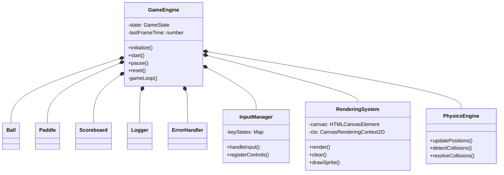
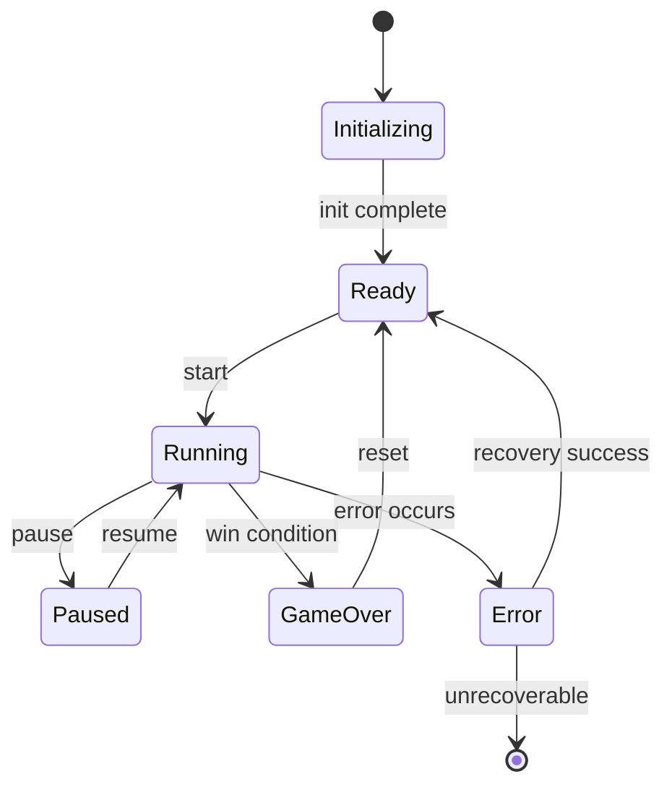
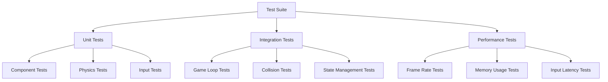
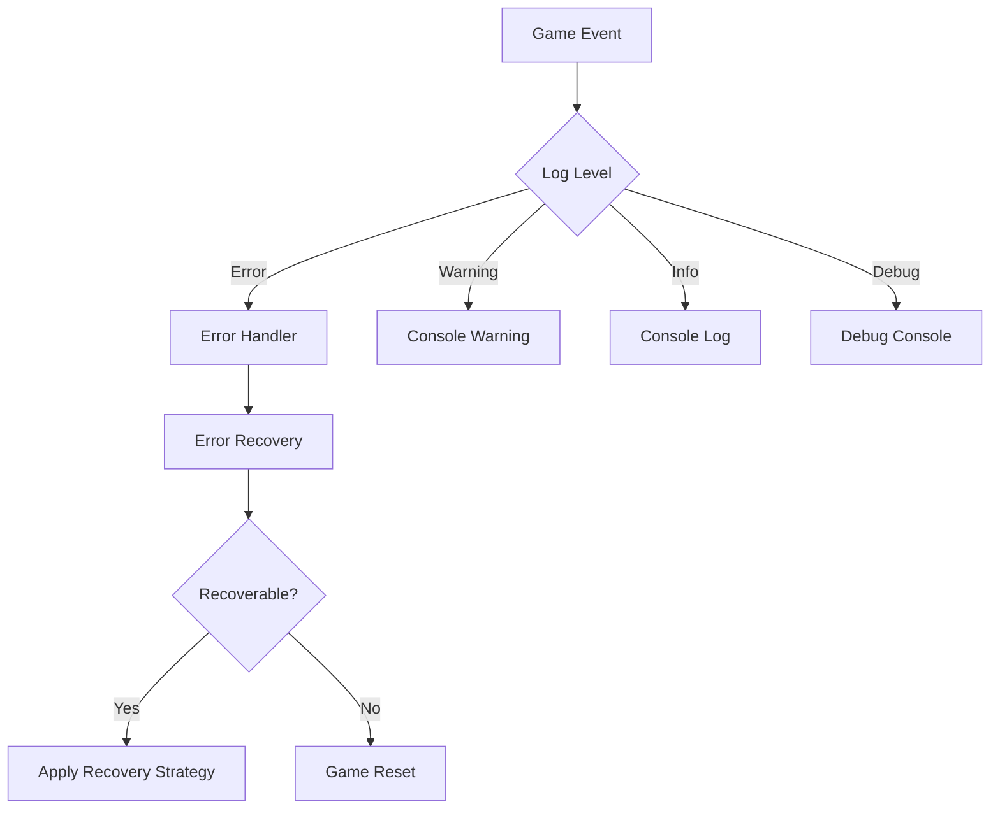

# Pong Game Architecture

## 1. System Architecture

### 1.1 Component Architecture



### 1.2 Interface Definitions

```typescript
interface IPhysicsEngine {
    updatePositions(deltaTime: number): void;
    detectCollisions(): Collision[];
    resolveCollisions(collisions: Collision[]): void;
}

interface IRenderingSystem {
    render(gameState: GameState): void;
    clear(): void;
    drawSprite(sprite: Sprite, position: Vector2D): void;
}

interface IInputManager {
    handleInput(deltaTime: number): void;
    registerControls(controls: Controls): void;
    isKeyPressed(key: string): boolean;
}

interface ILogger {
    log(message: string, level: LogLevel): void;
    error(error: Error): void;
    warn(message: string): void;
    debug(message: string): void;
}

interface IErrorHandler {
    handleError(error: GameError): void;
    registerRecoveryStrategy(type: ErrorType, strategy: RecoveryStrategy): void;
}
```

### 1.3 State Management



## 2. Testing Architecture

### 2.1 Test Suite Organization



### 2.2 Mock System Design

```typescript
// Mock Implementations
class MockPhysicsEngine implements IPhysicsEngine {
    private mockCollisions: Collision[] = [];
    
    setMockCollisions(collisions: Collision[]) {
        this.mockCollisions = collisions;
    }
    
    detectCollisions(): Collision[] {
        return this.mockCollisions;
    }
}

class MockRenderingSystem implements IRenderingSystem {
    private renderCalls: RenderCall[] = [];
    
    getRenderCalls(): RenderCall[] {
        return this.renderCalls;
    }
    
    clear(): void {
        this.renderCalls = [];
    }
}
```

### 2.3 Integration Test Strategy

```typescript
// Test Scenarios Structure
interface TestScenario {
    name: string;
    initialState: GameState;
    actions: GameAction[];
    expectedState: GameState;
    assertions: Assertion[];
}

// Integration Test Example
describe('Game Integration', () => {
    testScenarios.forEach(scenario => {
        it(scenario.name, async () => {
            // Setup initial state
            // Execute actions
            // Verify state transitions
            // Run assertions
        });
    });
});
```

## 3. Technical Infrastructure

### 3.1 Logging System



### 3.2 Error Handling Pattern

```typescript
// Error Types and Recovery Strategies
type ErrorType = 
    | 'PHYSICS_ERROR'
    | 'RENDER_ERROR'
    | 'INPUT_ERROR'
    | 'STATE_ERROR';

interface RecoveryStrategy {
    canRecover(error: GameError): boolean;
    recover(error: GameError): Promise<void>;
}

class ErrorRecoveryManager {
    private strategies: Map<ErrorType, RecoveryStrategy>;
    
    async handleError(error: GameError): Promise<void> {
        const strategy = this.strategies.get(error.type);
        if (strategy?.canRecover(error)) {
            await strategy.recover(error);
        } else {
            this.resetGame();
        }
    }
}
```

### 3.3 Performance Monitoring

```typescript
// Performance Metrics Collection
interface PerformanceMetrics {
    fps: number;
    frameTime: number;
    physicsTime: number;
    renderTime: number;
    memoryUsage: number;
}

class PerformanceMonitor {
    private metrics: PerformanceMetrics;
    private thresholds: PerformanceThresholds;
    
    collectMetrics(): void {
        // Collect current performance data
    }
    
    analyze(): void {
        // Analyze metrics against thresholds
    }
    
    reportIssues(): void {
        // Report performance issues
    }
}
```

## 4. Development Guidelines

1. **Code Organization**
   - Follow modular design patterns
   - Keep components loosely coupled
   - Use dependency injection
   - Implement interface-based design

2. **Testing Requirements**
   - Maintain 80%+ code coverage
   - Include performance benchmarks
   - Mock external dependencies
   - Test error recovery paths

3. **Performance Targets**
   - 60 FPS minimum
   - < 16ms frame time
   - < 100ms input latency
   - < 50MB memory usage

4. **Error Handling**
   - Log all errors with stack traces
   - Implement graceful degradation
   - Provide user feedback
   - Maintain game state integrity

## 5. Deployment Considerations

1. **Browser Compatibility**
   - Support latest 2 versions of major browsers
   - Fallback rendering for older browsers
   - Polyfills for required features

2. **Performance Optimization**
   - Asset preloading
   - RequestAnimationFrame optimization
   - Memory leak prevention
   - Garbage collection optimization

3. **Monitoring**
   - FPS monitoring
   - Error tracking
   - Performance metrics
   - User analytics