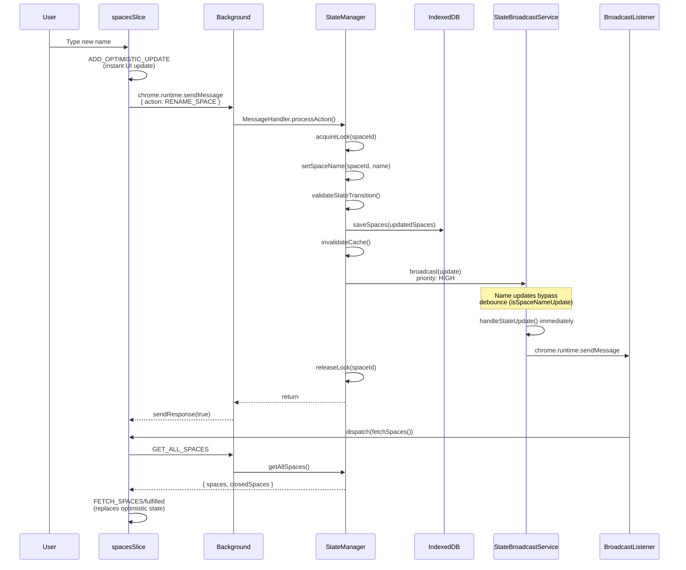
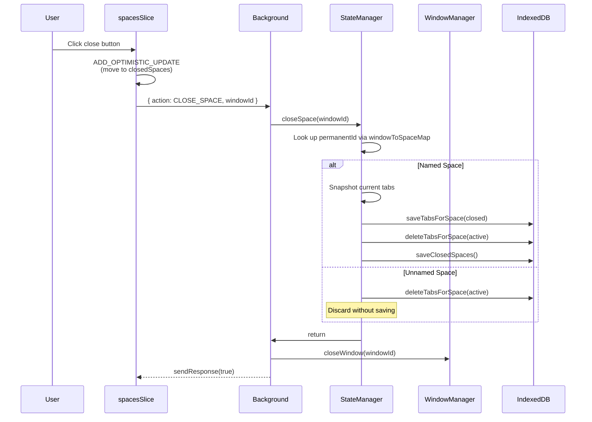
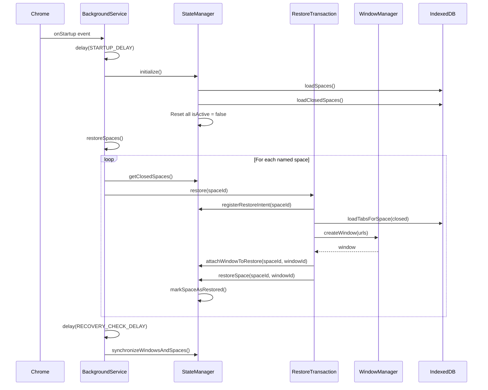

# State Flow Architecture

This document describes the complete state flow architecture of Chrome Spaces, including all state entry points, update paths, timing characteristics, and known race conditions.

## Table of Contents
- [Architecture Overview](#architecture-overview)
- [State Entry Points](#state-entry-points)
- [Core State Flow Diagrams](#core-state-flow-diagrams)
- [Timing Diagram](#timing-diagram)
- [Key Files and Responsibilities](#key-files-and-responsibilities)
- [Race Condition Scenarios](#race-condition-scenarios)
- [Known Issues](#known-issues)

---

## Architecture Overview

Chrome Spaces uses a dual-layer state architecture:

```
┌─────────────────────────────────────────────────────────────────────┐
│                         POPUP (React/Redux)                         │
│  ┌─────────────────┐    ┌────────────────┐    ┌─────────────────┐  │
│  │  spacesSlice.ts │◄───│ BroadcastList- │◄───│ chrome.runtime  │  │
│  │  (Redux State)  │    │ ener.tsx       │    │ .onMessage      │  │
│  └────────┬────────┘    └────────────────┘    └─────────────────┘  │
│           │                                                         │
│           │ optimistic update                                       │
│           ▼                                                         │
│  chrome.runtime.sendMessage({ action: ActionTypes.XXX })            │
└─────────────────────────────────────────────────────────────────────┘
                                    │
                                    │ IPC
                                    ▼
┌─────────────────────────────────────────────────────────────────────┐
│                    BACKGROUND (Service Worker)                      │
│  ┌─────────────────┐    ┌────────────────┐    ┌─────────────────┐  │
│  │ MessageHandler  │───►│ StateManager   │───►│ StorageManager  │  │
│  │                 │    │ (Central Hub)  │    │ (IndexedDB)     │  │
│  └─────────────────┘    └───────┬────────┘    └─────────────────┘  │
│                                 │                                   │
│                                 ▼                                   │
│  ┌─────────────────┐    ┌────────────────┐                         │
│  │ StateUpdate-    │◄───│ StateBroadcast │                         │
│  │ Queue           │    │ Service        │─────► chrome.runtime    │
│  └─────────────────┘    └────────────────┘       .sendMessage      │
└─────────────────────────────────────────────────────────────────────┘
```

### State Stores

| Store | Location | Purpose |
|-------|----------|---------|
| `spaces` | StateManager (in-memory) + IndexedDB | Active spaces with open windows |
| `closedSpaces` | StateManager (in-memory) + IndexedDB | Closed named spaces for restoration |
| Redux `spacesSlice` | Popup memory | UI state with optimistic updates |

---

## State Entry Points

State can change through three main pathways:

### 1. User Actions (via Redux/Popup)

```typescript
// spacesSlice.ts async actions
fetchSpaces()        // GET_ALL_SPACES - Fetches current state
renameSpace()        // RENAME_SPACE - Renames a space
closeSpace()         // CLOSE_SPACE - Closes and archives a space
restoreSpace()       // RESTORE_SPACE - Restores from closedSpaces
removeClosedSpace()  // REMOVE_CLOSED_SPACE - Permanently deletes
switchToSpace()      // SWITCH_TO_SPACE - Focuses a window
```

### 2. Chrome Events (via BackgroundService)

```typescript
// background/index.ts event listeners
chrome.runtime.onStartup      // Browser restart - triggers restoreSpaces()
chrome.runtime.onInstalled    // Extension install/update
chrome.runtime.onSuspend      // Service worker suspending
chrome.windows.onCreated      // New window - creates space
chrome.windows.onRemoved      // Window closed - archives space
chrome.windows.onFocusChanged // Window focus - ensures space exists
chrome.tabs.onCreated         // Tab created - ensures space exists
chrome.tabs.onUpdated         // Tab URL changed - syncs state
```

### 3. StateManager Public Methods

```typescript
// StateManager.ts public API
initialize()                    // Load state from IndexedDB
ensureInitialized()             // Lazy initialization
synchronizeWindowsAndSpaces()   // Reconcile windows with state
setSpaceName(spaceId, name)     // Rename operation
createSpace(windowId)           // Create new space
closeSpace(windowId)            // Move to closedSpaces
restoreSpace(spaceId, windowId) // Move from closedSpaces
rekeySpace(oldId, newWindowId)  // Re-associate after restore
```

---

## Core State Flow Diagrams

### Rename Space Flow (Critical Path)

This is the most timing-sensitive operation due to optimistic updates.



### Close/Restore Space Flow



### Browser Startup Restoration Flow



---

## Timing Diagram

Understanding timing is critical for debugging race conditions.

```
┌─────────────────────────────────────────────────────────────────────────┐
│                        TIMING WINDOWS                                   │
├─────────────────────────────────────────────────────────────────────────┤
│                                                                         │
│  StateUpdateQueue                                                       │
│  ├── batchWindow: 50ms (batches rapid updates)                         │
│  └── debounceTime: 200ms (delays storage commits)                      │
│                                                                         │
│  StateBroadcastService                                                  │
│  └── debounceTime: 100ms (coalesces broadcasts)                        │
│      EXCEPTION: Name updates and CRITICAL priority bypass debounce     │
│                                                                         │
│  Popup MESSAGE_TIMEOUT: 10000ms (10 seconds)                           │
│                                                                         │
│  Startup Delays                                                         │
│  ├── STARTUP_DELAY: (wait for Chrome to settle)                        │
│  └── RECOVERY_CHECK_DELAY: (double-check after restore)                │
│                                                                         │
│  StateManager Cache                                                     │
│  └── CACHE_TTL_MS: 5 * 60 * 1000 (5 minutes)                          │
│                                                                         │
└─────────────────────────────────────────────────────────────────────────┘

Timeline for a rename operation:

0ms     User types name
        ├── Redux: optimistic update (instant)
        └── sendMessage to background

~5ms    MessageHandler receives request
        └── StateManager.setSpaceName()

~10ms   Storage write completes
        └── StateBroadcastService.broadcast()

~10ms   Name update BYPASSES 100ms debounce
        └── chrome.runtime.sendMessage to popup

~15ms   BroadcastListener receives update
        └── dispatch(fetchSpaces())

~20ms   fetchSpaces sendMessage
        └── MessageHandler.handleGetAllSpaces()

~25ms   Response received
        └── Redux: FETCH_SPACES/fulfilled
        └── Optimistic update replaced with real state
```

---

## Key Files and Responsibilities

### Background Layer

| File | Responsibility |
|------|----------------|
| `src/background/index.ts` | Entry point, Chrome event handlers, service initialization |
| `src/background/services/StateManager.ts` | Central state coordinator, all CRUD operations, window-space mapping |
| `src/background/services/StateBroadcastService.ts` | Broadcasts state changes to popup, handles debouncing |
| `src/background/services/StateUpdateQueue.ts` | Batches updates, manages storage commits |
| `src/background/services/MessageHandler.ts` | Routes chrome.runtime messages to StateManager |
| `src/background/services/storage/IndexedDbStorageManager.ts` | IndexedDB persistence layer |

### Popup Layer

| File | Responsibility |
|------|----------------|
| `src/popup/store/slices/spacesSlice.ts` | Redux state, async actions, optimistic update logic |
| `src/popup/components/BroadcastListener.tsx` | Listens for background broadcasts, triggers fetchSpaces |

### Key StateManager Internal State

```typescript
class StateManager {
  // Primary state (keyed by permanentId)
  private spaces: Record<string, Space> = {};
  private closedSpaces: Record<string, Space> = {};

  // Fast lookup: windowId (number) -> permanentId (string)
  private windowToSpaceMap = new Map<number, string>();

  // Concurrency control
  private updateLock = new Map<string, Promise<void>>();
  private syncInProgress = false;

  // Cache
  private stateCache: Map<string, StateCache> = new Map();

  // Restoration protection
  private recentlyRestoredSpaces = new Map<string, RestoreInfo>();
}
```

---

## Race Condition Scenarios

### 1. Debounce Losing Intermediate Updates

**Scenario**: User rapidly renames a space multiple times.

```
User types: "Work" -> "Worki" -> "Workin" -> "Working"

With 100ms debounce, intermediate states may be lost:
- "Work" queued
- "Worki" replaces "Work" (coalesced)
- "Workin" replaces "Worki" (coalesced)
- 100ms passes...
- "Working" broadcast (but "Workin" was lost)
```

**Current Mitigation**: Name updates bypass debounce (`isSpaceNameUpdate` check).

### 2. Optimistic Update vs Broadcast Race

**Scenario**: Background broadcast arrives before async action completes.

```
t=0ms   User renames space
        Redux: optimistic update to "New Name"

t=5ms   Background processes rename

t=10ms  StateBroadcastService broadcasts
        BroadcastListener triggers fetchSpaces()

t=15ms  fetchSpaces RESPONSE arrives with OLD state
        (because async rename action hasn't completed)

t=20ms  Redux: FETCH_SPACES/fulfilled
        UI REVERTS to old name!

t=25ms  Actual rename response arrives
        But state already overwritten
```

**Current Mitigation**: StateBroadcastService bypasses debounce for name updates, reducing the race window.

### 3. Cache Returning Stale Data

**Scenario**: State modified but cache not invalidated.

```typescript
// StateManager.getSpaceById uses cache
async getSpaceById(spaceId: string): Promise<Space | null> {
  return this.getStateWithCache(`space:${spaceId}`, async () => {
    // Only called if cache miss
    return this.spaces[spaceId] || this.closedSpaces[spaceId];
  });
}

// If cache contains old data and TTL hasn't expired,
// stale data is returned even after modification
```

**Current Mitigation**: `invalidateCache()` called after modifications, but timing-sensitive.

### 4. Synchronization During Restoration

**Scenario**: `synchronizeWindowsAndSpaces()` runs before restored space has tabs.

```
t=0ms   restoreSpace() called
        Window created with 0 tabs initially

t=5ms   synchronizeWindowsAndSpaces() triggered
        Window has 0 tabs (Chrome hasn't created them yet)
        URL matching fails
        Space considered "orphaned"
        Named space moved to closedSpaces!

t=50ms  Tabs finally load in window
        But space already archived
```

**Current Mitigation**: `recentlyRestoredSpaces` map protects spaces from validation temporarily.

### 5. Service Worker Wake-Up Race

**Scenario**: Message arrives while service worker is initializing.

```
t=0ms   Service worker starts (was suspended)
        StateManager.initialized = false

t=5ms   Message arrives: RENAME_SPACE
        MessageHandler.processAction() called

t=10ms  StateManager.setSpaceName() called
        ensureInitialized() blocks

t=50ms  initialize() completes
        But spaces may have been reset incorrectly
```

**Current Mitigation**: `ensureInitialized()` with initialization lock prevents concurrent init.

---

## Known Issues

### Issue 1: Broadcast Coalescing May Lose Updates

When `coalesceUpdates: true`, rapid updates of the same type are merged:

```typescript
// StateBroadcastService.coalesceUpdate()
private coalesceUpdate(update: QueuedStateUpdate): QueuedStateUpdate {
  const existing = this.pendingUpdates.get(update.type);
  return {
    ...update,
    payload: this.mergePayloads(existing.payload, update.payload)
  };
}
```

**Problem**: If payload structure differs, merge may produce incorrect state.

### Issue 2: fetchSpaces After Broadcast Overwrites Optimistic Updates

```typescript
// BroadcastListener.tsx
const handleMessage = (message: any) => {
  if (message.type === MessageTypes.SPACES_UPDATED || ...) {
    dispatch(fetchSpaces()); // Fetches ALL state, replacing optimistic
  }
};
```

**Problem**: `fetchSpaces()` returns full state, overwriting any pending optimistic updates.

### Issue 3: No Version Conflict Resolution

```typescript
// StateManager.validateStateTransition()
if (newState.version <= oldState.version) {
  throw new Error('Space version must increase on update');
}
```

**Problem**: Simple version check doesn't handle concurrent modifications. Two clients could increment the same version.

### Issue 4: Window-Space Mapping Rebuilt on Every Sync

```typescript
// synchronizeWindowsAndSpaces()
this.windowToSpaceMap.clear();
// ... rebuild from scratch
```

**Problem**: During rebuild, lookups return null, potentially causing duplicate space creation.

---

## Debugging Tips

### Inspect Background State

```javascript
// In background service worker console
chrome.runtime.getBackgroundPage(page => {
  console.log(page.stateManager.getAllSpaces());
});
```

### Force State Sync

```javascript
// From popup or extension page
chrome.runtime.sendMessage({ type: 'SYNC_STATE' }, console.log);
```

### Watch for Specific Message Types

```javascript
// In popup console
chrome.runtime.onMessage.addListener((msg) => {
  console.log('[Message]', msg.type, msg);
});
```

### Check Pending Optimistic Updates

```javascript
// In popup Redux DevTools
store.getState().spaces.optimisticUpdates
```
